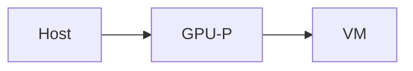
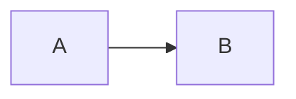

# 博客框架使用文档

静态导出的 Next.js 个人博客。文章写在 `content/posts/` 的 Markdown 里，用指令（`:::note` / `::github`）嵌入组件，不必改成 `.mdx`，也不用在文中 `import` React。

推到 `main` 后由 GitHub Actions 构建并发布到 GitHub Pages。

---

## 命令

```bash
npm install
npm run dev          # 本地预览（不要另开端口抢 3001）
npm run build        # 静态导出到 out/（会先拷贝文章资源）
npm run typecheck
npm run lint
```

构建前脚本 [`scripts/copy-post-assets.mjs`](../scripts/copy-post-assets.mjs) 会把每个**文章目录**里的非 Markdown 文件复制到 `public/post-assets/<slug>/`。

子路径部署时设置环境变量 `NEXT_BASE_PATH`（例如 `/blog`）。当前 Actions 使用空 base path。

---

## 站点配置

编辑 [`content/site.json`](../content/site.json)。

| 字段 | 作用 |
| --- | --- |
| `title` | 站点名、浏览器标题模板 `页面 · 站点名` |
| `avatar` | 侧栏 / 关于页头像，放在 `public/` |
| `favicon.*` | 亮/暗色 32 / 180 / 192 图标 |
| `author.name` / `bio` | 侧栏与关于页资料 |
| `author.links` | 关于页社交链接 |
| `pages.*.title` / `description` | 各列表页标题与说明 |
| `pages.*.descriptionTemplate` | 归档 / 标签 / 分类页，`{count}` 会被替换 |
| `giscus` | 文章页评论（见下文） |

作者链接的 `type` 决定图标：`github`、`qq`、`email`、`twitter`、`telegram`、`discord`、`bilibili`、`website`、`wechat`、`youtube`。未知类型用通用外链图标。

站点图标、头像等静态文件放在 `public/`。

---

## 页面能力

- **首页 `/`**：文章卡片网格，每页 6 篇。搜索框匹配标题、摘要、标签、分类；查询写入 `?q=` / `?p=`，可分享。
- **归档 `/archive`**：按日期列出全部已发布文章。
- **标签 `/tags`、`/tags/:tag`**：标签云与该标签下的文章。
- **分类 `/categories`、`/categories/:category`**：分类列表与该分类下的文章。未写 `category` 的文章归入「未分类」。
- **关于 `/about`**：左侧作者卡（来自 `site.json`），右侧正文来自 `content/pages/about.md`（**仅 GFM**，没有文章指令组件）。文件不存在时显示占位提示。
- **文章 `/posts/:slug`**：标题、发布日期、分类、标签、正文、Giscus、浮动目录、阅读进度条。从列表点进文章时，标题会做卡片变形过渡。

侧栏：主页 / 归档 / 标签 / 分类 / 关于，以及亮暗色切换。主题默认跟随系统，也可手动覆盖（记在 `localStorage`）。桌面侧栏展开状态会记住。

文章页额外交互：

- 标题旁的 `#` 可复制锚点（h1–h6）。
- 浮动目录收录正文 **h1–h3**。
- 阅读进度条贴在主栏顶部，按 `.post-article-body` 滚动计算。
- 返回列表时尽量恢复该列表的滚动位置；进入文章一律从顶部开始，不恢复阅读进度。

---

## 写文章

### 文件位置

两种写法都可以，**带资源的文章请用目录形式**：

```text
content/posts/learn-hyperv-gpup/index.md
content/posts/learn-hyperv-gpup/assets/gpu-details.png
```

或单文件（无同目录资源）：

```text
content/posts/hello.md
```

`slug` 是目录名或去掉扩展名的文件名，对应 URL `/posts/<slug>`。也支持 `index.mdx`，但组件仍靠指令，不必用 JSX。

### Front matter

```yaml
---
title: 教程向：如何配置Hyper-V GPU 分区 (GPU-P)
published: 2025-08-05
updated: 2026-08-22
description: "一句话摘要，出现在卡片和 SEO。"
image: assets/cover.png
tags: ["Windows", "Hyper-V"]
category: "与Windows的爱恨情仇"
draft: false
---
```

| 字段 | 必需 | 说明 |
| --- | --- | --- |
| `title` | 是 | 空标题的文章不会出现在列表 |
| `published` | 是 | 日历日 `YYYY-MM-DD`。YAML 日期会归一到当天，避免时区错一天。列表按此字段倒序 |
| `description` | 否 | 卡片摘要；缺省显示「点击阅读全文…」 |
| `image` | 否 | 列表封面。相对路径相对文章目录，会解析成 `/post-assets/<slug>/...`；也可用 `/...` 或绝对 URL。文章页本身没有封面图 |
| `tags` | 否 | 字符串数组。卡片最多展示 3 个 |
| `category` | 否 | 单个分类字符串 |
| `draft` | 否 | `true` 则不进列表、不生成页面 |
| `updated` | 否 | 会解析并缓存，**当前界面不展示** |

其它键（例如 `lang`、`validityCheck`）会被忽略，不影响构建。

### 正文资源

文中相对图片：

```md

```

构建时改写为 `/post-assets/<slug>/assets/gpu-details.png`。以 `/`、`http(s):`、`data:` 开头的地址不改写。

只有**文章目录**里的非 `.md` / `.mdx` 会被拷到 `public/post-assets/`。点名文件 `hello.md` 旁边的图片不会自动复制。

正文图片默认点击放大，Esc 或点遮罩关闭。不需要放大时加 `data-no-zoom`（组件内部已用于 YouTube 封面）。

带标题的图片会变成 figure + 图注：

```md

```

---

## 通用 Markdown（GFM）

文章与关于页都支持 GitHub Flavored Markdown：

- 标题、段落、强调、删除线、链接、行内代码
- 有序 / 无序列表、任务列表 `- [ ]` / `- [x]`
- 表格、脚注、自动链接
- 引用 `>`
- HTML 片段：`<kbd>`、`<mark>`、`<details>`（文章页有样式）

```md
按 <kbd>Win</kbd>+<kbd>R</kbd>，注意 <mark>GPU-P</mark> 与 DDA 的区别。

- [x] 已完成
- [ ] 待办

这里有个脚注。[^1]

[^1]: 脚注正文。
```

关于页**没有**下面的指令组件、代码增强、KaTeX、Mermaid。

---

## 代码块

Shiki 高亮（亮 `github-light` / 暗 `github-dark`），带语言徽标和复制按钮。预置语言包括 PowerShell、shell、JS/TS、JSON、XML、YAML、Markdown、HTML、CSS、diff；其它语言会按需加载。`` ```log `` 会当成 `plaintext`。

### 文件名标题

```md
```powershell title="setup-gpup.ps1"
Get-VMHostPartitionableGpu
```
```

### 行号

```md
```powershell showLineNumbers
Get-VM
```

```powershell showLineNumbers{10}
# 从第 10 行起编号
```
```

### 行高亮 / 词高亮

rehype-pretty-code 语法：

```md
```ts {2,4-5}
const a = 1
const b = 2
const c = 3
const d = 4
const e = 5
```
```

### 步骤注记

在指定行范围旁显示说明（可多段）：

```md
```powershell {"1. 改成你的虚拟机名": 2-4} {"2. 添加适配器": 6-8}
# 注释
$vm = "exampleName"
$gpuPath = "examplePath"

Remove-VMGpuPartitionAdapter -VMName $vm
Add-VMGpuPartitionAdapter -VMName $vm -InstancePath $gpuPath
```
```

围栏后的 `wrap=...` 只会被剥掉，**不会改变换行行为**。代码默认横向滚动。

---

## 数学（KaTeX）

仅当正文里出现 `$$`、`\(`、`\[` 或 `\begin{` 时才启用（避免每篇都加载 KaTeX）。**单独的 `$...$` 不会打开数学插件。**

```md
行内：\(\alpha + \beta\)

独立：

$$
I = \int_0^{2\pi} \sin(x)\,dx
$$
```

---

## 指令语法通则

三种形态（[remark-directive](https://github.com/remarkjs/remark-directive)）：

| 形态 | 写法 | 用途 |
| --- | --- | --- |
| 容器 | `:::name` … `:::` | 提示框、Tabs、图集等 |
| 叶子 | `::name{attr="value"}` | GitHub 卡、YouTube、文章链 |
| 文本 | `:name[文本]{attr=}` | Badge |

属性写在 `{}` 里。方括号是标签：`:::details[进阶说明]`。

**嵌套时，外层要比内层多一截冒号。** 关闭围栏只要不少于对应的开启围栏就会闭合；内层如果写成 `::::`，会把外层 `:::tabs` 一起关掉，页面上就会漏出裸的 `:::`。

```md
::::tabs
:::tab[PowerShell]
内容
:::
:::tab[CMD]
内容
:::
::::
```

---

## 提示框

五种：`note` / `tip` / `important` / `warning` / `caution`。也接受 GitHub Alerts。

```md
:::tip
相对配额范围是 0–1,000,000,000。
:::

:::warning[Windows Server]
还要改两项注册表。
:::

> [!NOTE]
> GitHub 风格同样会变成提示框。

> [!CAUTION]
> 危险操作。
```

---

## 结构组件

### Tabs

`group` 相同的 Tabs 会通过 `localStorage` 同步选中项（例如全站「PowerShell / CMD」）。左右方向键、Home / End 可切换。

```md
::::tabs{group="os"}
:::tab[PowerShell]
```powershell showLineNumbers
Get-VMHostPartitionableGpu
```
:::
:::tab[CMD]
```bat
systeminfo
```
:::
::::
```

标签来自 `:::tab[名称]`，也可用 `label=` / `title=`。

### Details

```md
:::details[进阶说明]
折叠内容，里面可以再套提示框或代码。
:::

:::details[默认展开]{open=true}
一开始就是打开的。
:::
```

原生 `<details><summary>…</summary>…</details>` 也会套上同样样式。

### Steps

把有序列表画成大号步骤：

```md
:::steps
1. 打开 Hyper-V 管理器
2. 关闭目标虚拟机
3. 分配 GPU 分区
:::
```

### 文件树

无序列表。名称以 `/` 结尾或含嵌套列表的是文件夹（可折叠）。`**粗体**` 高亮，`…` / `...` 表示省略。

```md
:::filetree
- C:/
  - Windows/
  - **vmgpudevice.inf** 关键驱动
  - …
:::
```

---

## 媒体

### Figure

```md
:::figure[宿主机上的 GPU-P 设备]

:::
```

或上一节的 ``。

### 图集

```md
:::gallery


:::
```

子图同样可以点击放大。

### YouTube

先显示 `i.ytimg.com` 封面，点击后再加载 `youtube-nocookie.com` 播放器。`id` 可以是 11 位视频 ID，或 `youtube.com/watch?v=` / `youtu.be/` 链接。无效 id 不渲染。

```md
::youtube{id="dQw4w9WgXcQ"}
::youtube{id="https://www.youtube.com/watch?v=dQw4w9WgXcQ" title="演示"}
```

封面图依赖 YouTube 图床；被拦时只剩播放按钮。

### Mermaid

写成 ` ```mermaid ` 围栏（会在高亮之前抽出来，不当代码着色）。运行时按需加载 mermaid，并随站点亮/暗色重绘。配色是 mermaid 自带主题，不会完全对齐 Fluent 色板。渲染失败时回退为源码。

```md

```

---

## 卡片与元信息

### GitHub 仓库卡

客户端请求 GitHub API，展示简介、星标、Fork、许可证。需要读者能访问 `api.github.com`。格式必须是 `owner/repo`。

```md
::github{repo="Singl-Daemon/blog"}
```

### 链接卡

纯静态，不抓 Open Graph。外链新标签打开；站内路径走客户端路由。

```md
::link{href="https://learn.microsoft.com" title="Microsoft Learn" desc="官方文档"}
::link{href="/posts/learn-hyperv-gpup" title="GPU-P 教程" desc="本站文章"}
```

`desc` 与 `description` 等价。

### 卡片网格

```md
::::cards
:::card{title="GPU-P 教程" href="/posts/learn-hyperv-gpup"}
同一篇文章的入口。
:::
:::card{title="文档" href="https://learn.microsoft.com"}
外部链接。
:::
:::card{title="仅展示"}
没有 href 就不是链接。
:::
::::
```

### 文章内链

用 slug 解析已发布文章的标题和地址。草稿、不存在或未发布的 slug **不渲染、不报错**。

```md
参见 ::post{slug="learn-hyperv-gpup"}。
```

### 引言

```md
:::quote{author="Microsoft" source="Learn" href="https://learn.microsoft.com"}
引用正文。
:::
```

`author`、`source`、`href` 都可省略。只有 `source` 时不做成链接。

### Badge

颜色与提示框一致：`note` / `tip` / `important` / `warning` / `caution`。未知 `type` 当作 `note`。

```md
:badge[实验性]{type="warning"}
:badge[稳定]{type="tip"}
```

---

## 评论（Giscus）

文章页底部。配置在 `site.json` 的 `giscus`：

- `repo` / `repoId` / `category` / `categoryId`：GitHub Discussions
- `mapping`: `pathname`（按路径挂讨论）
- `emitMetadata`: `"1"` 时评论数可回传（需在 Giscus 后台打开）
- `lang`: `zh-CN`
- 主题 CSS：`/giscus-winui-light.css` 与 `giscus-winui-dark.css`，随站点主题切换

仓库要先在 [giscus.app](https://giscus.app) 接好 Discussions。

---

## 部署

[`.github/workflows/deploy.yml`](../.github/workflows/deploy.yml)：推送 `main` 或手动触发 → `npm ci` → typecheck → lint → `next build` → 上传 `out/` → GitHub Pages。

本地 `npm run build` 的产物也在 `out/`，可用任意静态服务器预览。

---

## 刻意不做

- 文中 JSX `import`、在线 sandbox、TypeTable、npm2yarn
- Tweet / X / Instagram / Vimeo 嵌入
- 运行时抓取链接预览（无后端）
- 恢复文章阅读滚动位置
- 文章页大图封面（`image` 只给列表卡片用）

---

## 速查

```md
:::note / tip / important / warning / caution
::::tabs + :::tab[标签]   :::details[标题]   :::steps   :::filetree
:::figure[图注]   :::gallery   ::::cards + :::card   :::quote
::github{repo="owner/repo"}   ::youtube{id="…"}   ::link{href title desc}
::post{slug="…"}   :badge[文本]{type="warning"}

```js title="a.ts" showLineNumbers {2} {"说明": 1-2}
```




<kbd>Win</kbd>  <mark>高亮</mark>
> [!TIP]
> GitHub Alert
```
